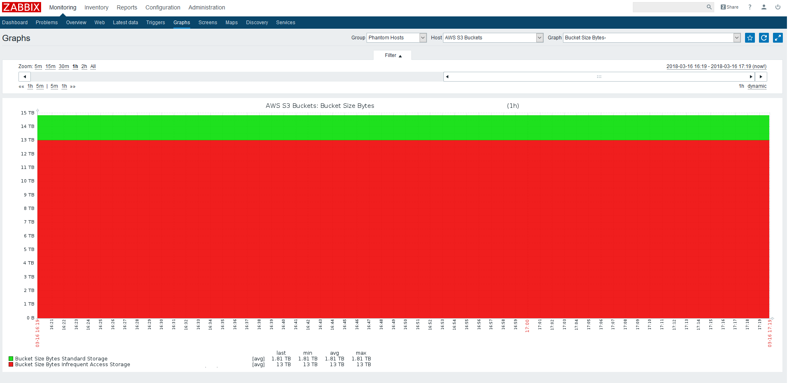

## 1. About

Automatically discovers your buckets in AWS S3 and then:
Pulls 3 data:
* StandardStorage type bucket size
* StandardIAStorage type bucket size
* Number of objects in buckets

Works on CentOS 7 and Zabbix v3.4.7.  
Pulls Cloudwatch metrics regarding to your buckets. Size and Number of objects.  
Look through the scripts first. Adjust them to your needs.  
Used commands: aws jq sed bc date  

## 2. Install and Configure

1. Create new AWS IAM Account for your zabbix server. Set up permissions (explained down below).  
  1.1. Get access and secret key  
  1.2. Set up IAM Policy permissions  
2. Drop all 3 scripts from `externalscripts` folder to your zabbix server `externalscripts` folder.  
  2.1 Check /etc/zabbix/zabbix_server.conf if in doubt about the location of that folder.
3. Change zabbix user shell: `usermod -s /bin/bash zabbix`
4. Install awscli: `yum -y install awscli`
5. Configure aws cli with the credentials what you created in IAM. **use json** as output format!  
   5.1 To configure aws cli run: `aws configure`
6. Manually run and test the scripts
7. Import the template: `templates\template-aws-s3-bucket-metrics.xml`
8. Create a phantom host and apply the template  
  8.1 You might want to decrease the template discovery `Update interval` to get the metrics faster.  
  8.2 Same for the items prototypes  

## 3. Policy objects

Apply these to aws iam zabbix account.

### 3.1 policy-ListBuckets

```json
{
    "Version": "2012-10-17",
    "Statement": [
        {
            "Sid": "VisualEditor0",
            "Effect": "Allow",
            "Action": [
                "s3:ListAllMyBuckets",
                "s3:ListBucket"
            ],
            "Resource": "*"
        }
    ]
}
```

### 3.2 policy-CloudWatch-GetMetricData

```json
{
    "Version": "2012-10-17",
    "Statement": [
        {
            "Sid": "VisualEditor0",
            "Effect": "Allow",
            "Action": [
                "cloudwatch:GetMetricData",
                "cloudwatch:GetMetricStatistics"
            ],
            "Resource": "*"
        }
    ]
}
```

### 4. Screenshot


